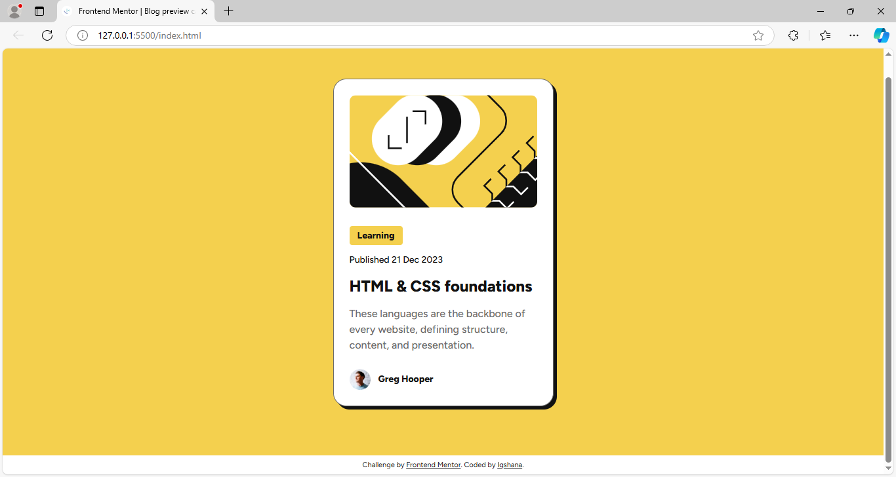

# Frontend Mentor - Blog preview card solution

This is a solution to the [Blog preview card challenge on Frontend Mentor](https://www.frontendmentor.io/challenges/blog-preview-card-ckPaj01IcS). Frontend Mentor challenges help you improve your coding skills by building realistic projects. 

## Table of contents

- [Overview](#overview)
  - [The challenge](#the-challenge)
  - [Screenshot](#screenshot)
  - [Links](#links)
- [My process](#my-process)
  - [Built with](#built-with)
  - [What I learned](#what-i-learned)
  - [Continued development](#continued-development)
  - [Useful resources](#useful-resources)
- [Author](#author)
- [Acknowledgments](#acknowledgments)


## Overview

The Blog preview card challenge aimed to create a responsive and accessible card that showcases a blog post. Users can interact with various elements, seeing hover and focus states for improved usability. The design follows a mobile-first approach, ensuring a seamless experience on both mobile (375px) and desktop (1440px) devices. By utilizing semantic HTML, Flexbox for layout, and CSS techniques to enhance accessibility, this project not only improves coding skills but also reinforces the importance of user experience.


### The challenge

I encountered challenges with responsive design, particularly in maintaining consistent spacing and alignment across different screen sizes. Additionally, I faced accessibility issues, especially ensuring adequate color contrast and implementing keyboard navigation for interactive elements while learning advanced CSS techniques.


### Screenshot



### Links

- Live Site URL: [Blog preview card - site](https://anahsqi.github.io/Blog-preview-card/)

## My process

**Research and Planning:**

I started by thoroughly reading the challenge requirements on Frontend Mentor and reviewing the design files. I took note of the layout specifications for mobile and desktop views (375px and 1440px).
I then sketched out the general structure of the page, dividing it into sections: the image thumbnail, content, and author details.

**Setting Up the Project:**

I created the HTML structure, ensuring that I used semantic elements like <article>, <main>, and <footer>. This helped keep the code clear and accessible.
I linked the Figtree font from Google Fonts.

**Mobile-First Approach:**

I began coding the CSS for mobile screens (375px) as the primary design. I made sure that all elements were sized and spaced appropriately for smaller devices.
I used Flexbox to align items and ensure a clean layout. For example, I centered the article content on the screen and used flex properties to manage spacing between elements.

**Interactive Elements:**

I added hover states for interactive elements such as links, making sure they responded visually to user interactions. This helps with user engagement and improves UX.

**Responsive Design:**

Once the mobile design was working, I used media queries to adjust the layout for tablet (768px) and desktop (1440px) screens.

**Final Testing:**

After completing the layout for all screen sizes, I tested the site across various devices and screen resolutions to ensure everything was responsive and accessible.
I used Lighthouse in Chrome DevTools to verify that performance and accessibility metrics were met, making any adjustments where needed.


### Built with

- Semantic HTML5 markup
- CSS custom properties
- Flexbox
- Mobile-first workflow

### What I learned

Here are some key things I learned while building this project:

1. **CSS Flexbox** for creating responsive layouts and aligning elements.
2. **CSS hover effects**: Improving the interactivity by using transitions and hover states.

```css
/* Example of a hover effect for better user experience */
.title a:hover{
    color:hsl(47, 88%, 63%);
    cursor: pointer;
}
```
### Continued development

In the future, I'd like to focus more on refining:

Responsive design techniques
Accessibility improvements
Performance optimizations for mobile

### Useful resources

- MDN Web Docs - Helped me understand various CSS properties and best practices.
- [CSS Tricks](https://css-tricks.com/)- A great resource for various CSS techniques and tips.

## Author

- Frontend Mentor - [Frontend Mentor/Iqshana](https://www.frontendmentor.io/profile/Anahsqi)
- Github - [Github/Iqshana](https://github.com/Anahsqi)


## Acknowledgments

Thanks to the Frontend Mentor community for the inspiration and resources provided!
